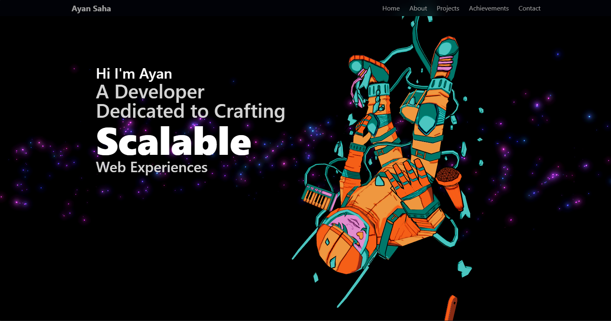

<div align="center">

<!-- COVER IMAGE — replace with your own -->


<br/>

# ✦ My Portfolio

### *A space-themed, interactive 3D portfolio built to leave an impression.*

[](https://your-live-link.vercel.app)
&nbsp;
[](https://react.dev)
&nbsp;
[](https://threejs.org)
&nbsp;
[](https://tailwindcss.com)
&nbsp;
[](https://www.framer.com/motion)

<br/>

<!-- GIF — replace with your recording -->

> 
> 


<br/>

> 🔗 **Want to experience the full thing? [Click the live demo](https://ayan-saha.vercel.app/) — some effects only come alive in motion.**

</div>

---

## ⚡ Tech Stack

| Layer | Technology |
|-------|-----------|
| Framework | React 19 |
| Styling | Tailwind CSS |
| 3D Rendering | Three.js · React Three Fiber |
| Animations | Framer Motion |
| UI Components | Aceternity UI |

---

## 🪐 Features

### 🌌 Hero Section
- **Floating 3D Astronaut** — A GLB model rendered with React Three Fiber that floats in the hero, setting the space theme from the first second
- **FlipWords** — Animated word-flip component from Aceternity UI cycling through roles and traits
- **Vortex Background** — A wavy, swirling animated background from Aceternity UI wrapping the entire portfolio in an atmospheric visual layer

---

### 👨‍🚀 About Section
- **Interactive 3D Globe** — Built with Three.js and React Three Fiber, representing global collaboration and remote-first development
- **Glare Cards** — Aceternity UI cards with a shining 3D glare effect used to display skills in a tactile, physical way
- **Draggable Card** — A fully interactive drag-to-explore card for an immersive experience

---

### 🛸 Projects Section
- **Rotating 3D Cylinder** — A custom Three.js cylinder that rotates to showcase projects in a unique, carousel-style 3D display — no flat grid, no boring list
- **Marquee Section** — added a simple and minimalistic marquee under the rotating cylinder for showcasing the projects name used framermotion for this 
---

### 🏆 Awards & Achievements Section
- **Typewriter Effect** — Text reveals itself character-by-character for a dramatic storytelling feel
- **Scroll-triggered Cards** — Framer Motion animates cards into the viewport as you scroll
- **SVG Path Arrows** — Animated SVG arrows that draw themselves along a path, guiding the narrative between milestones

---

### 📬 Contact Section
- **Contact Form** — A fully interactive form so anyone can reach out directly from the site

---

## 📁 Project Structure

```
My-Portfolio/
├── public/
│   ├── assests/                        # Images and static media
│   │   ├── Cover.png
│   │   ├── planets.png
│   │   ├── space.jpg / stars.jpg / sky.jpg
│   │   ├── Project1.png, Project2.png, Project3.png
│   │   └── certificate.jpg / Certificate1.jpg
│   ├── logos/                          # Tech stack and social icons
│   │   ├── gsap.svg, framer-motion.svg
│   │   ├── icons8-react-96.png
│   │   ├── icons8-threejs-96.png
│   │   ├── icons8-tailwind-css-96.png
│   │   ├── icons8-nextjs-96.png
│   │   ├── leetcode.svg, code-forces.svg
│   │   └── vercel.png, Wellfound.svg
│   ├── models/
│   │   └── tenhun_falling_spaceman_fanart.glb  # 3D Astronaut model
│   └── Certificate.pdf
│
├── src/
│   ├── components/                     # Reusable UI & 3D components
│   │   ├── Astronaut.jsx               # R3F floating astronaut (3D)
│   │   ├── Globe.jsx                   # Interactive 3D globe (Three.js)
│   │   ├── cylinder.jsx                # Rotating 3D project cylinder
│   │   ├── Model.jsx / Model2.jsx / Model3.jsx
│   │   ├── Background.jsx              # Vortex animated background
│   │   ├── FlipWords.jsx               # Aceternity word-flip component
│   │   ├── Typewriter.jsx / type.jsx   # Typewriter text effect
│   │   ├── Cards.jsx                   # Glare cards for skills
│   │   ├── ParallaxBackground.jsx      # Parallax scroll layers
│   │   ├── Arrow.jsx / Arrow2.jsx      # SVG path animated arrows
│   │   ├── HeroText.jsx                # Animated hero heading
│   │   ├── Alert.jsx                   # Notification alert
│   │   ├── Text.jsx                    # Shared text component
│   │   └── loader.jsx                  # Loading screen
│   │
│   ├── sections/                       # Full page sections
│   │   ├── Hero.jsx                    # Landing + astronaut + FlipWords
│   │   ├── About.jsx                   # Globe + Glare cards + Draggable
│   │   ├── Skills.jsx / skills2.jsx / skills3.jsx
│   │   ├── Projects.jsx                # 3D cylinder showcase
│   │   ├── Page.jsx                    # Awards & Achievements
│   │   ├── Final.jsx                   # Closing / CTA section
│   │   ├── Contact.jsx                 # Contact form
│   │   ├── Footer.jsx
│   │   ├── navbar.jsx
│   │   └── copy.jsx
│   │
│   ├── constants/
│   │   ├── met.js                      # Site metadata & content
│   │   └── mySocials.js                # Social links config
│   │
│   ├── lib/
│   │   └── utils.js                    # Utility/helper functions
│   │
│   ├── App.jsx                         # Root component & routing
│   ├── main.jsx                        # React entry point
│   └── index.css                       # Global styles & Tailwind base
│
├── eslint.config.js
├── index.html
├── package.json
└── vite.config.js
```

---

## 🛠️ Run Locally

```bash
# Clone the repository
git clone https://github.com/YOURCODERAYAN/My-Portfolio.git

# Navigate into the project
cd My-Portfolio

# Install dependencies
npm install

# Start the dev server
npm run dev
```

---

## 📬 Contact

<div align="center">

If you'd like to collaborate, hire, or just say hi —

**[✉️ Reach out via the site](https://ayan-saha.vercel.app/#contact)**
&nbsp;·&nbsp;
**[GitHub](https://github.com/YOURCODERAYAN)**

<br/>

*Designed & built by **Ayan** — 2025*

</div>
